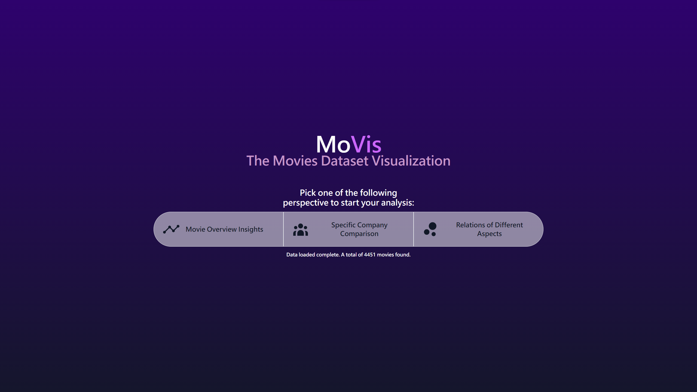
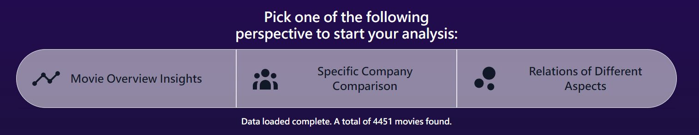
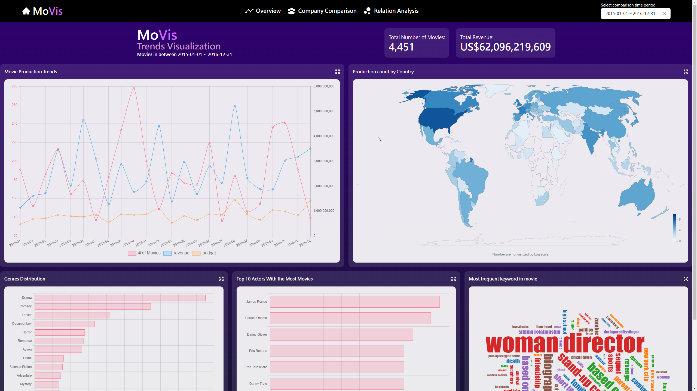
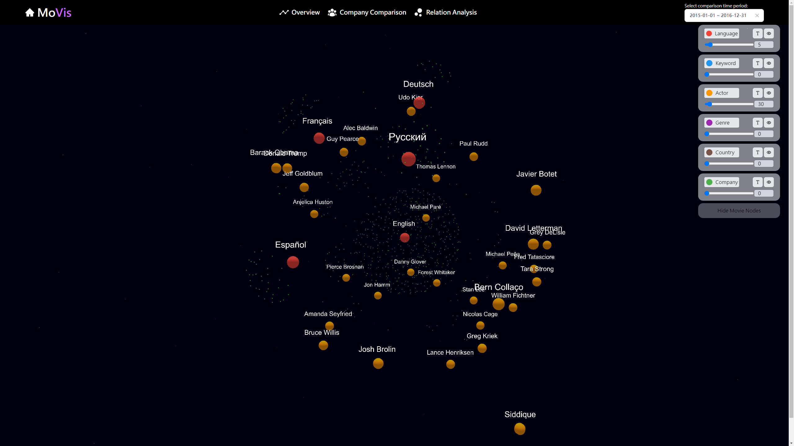
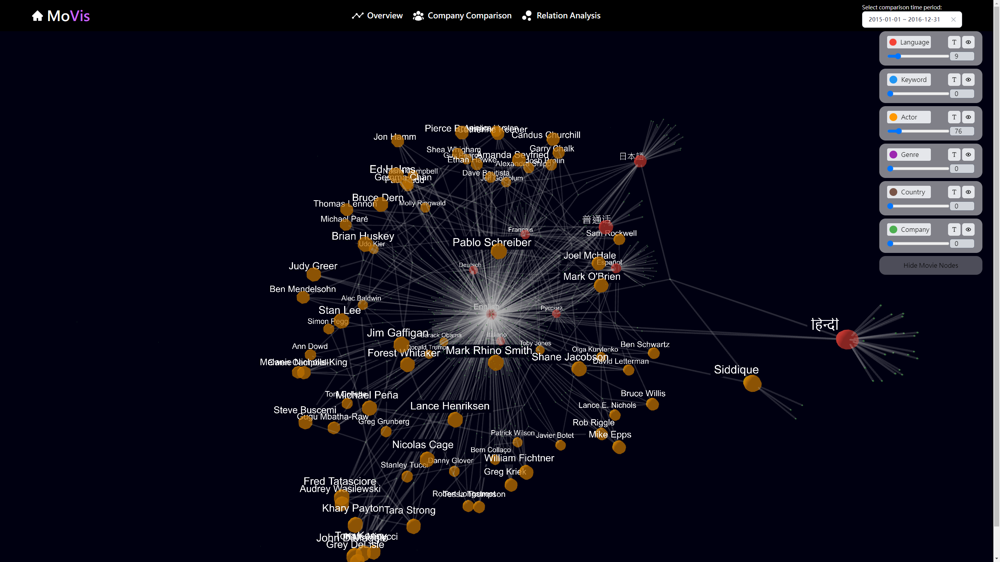
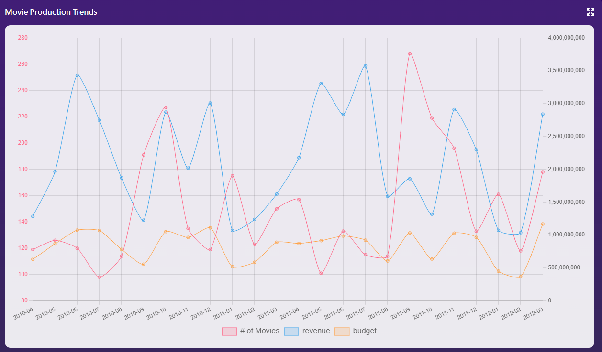
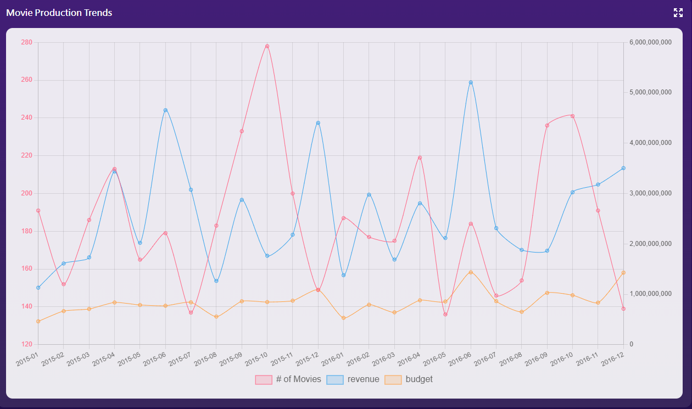
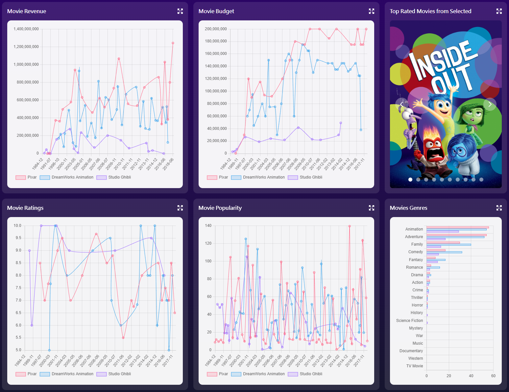

## MoVis -  Final Project

#### 535517 資料視覺化與視覺分析 Data Visualization and Visual Analytics

##### Group #1: 0716021 張家豪、0816137 王培碩、0816153 陳琮方


## Dataset


Firstly, we use ```python``` to call **[TMDB](https://www.themoviedb.org/)**'s API to get the movies data. Crawling, parsing, and formating to the specific format.   

Then, we used the script to import the data to **[PlanetScale](https://planetscale.com/)**, which is a serverless MySQL platform. 


## MoVis System Introduction

### Home



This is the home page of the **MoVis** system, when client first connect to the website, the system would preload the movie data in default date range, which is ```2015-01-01``` to ```2016-12-31```.

#### Navigation Bar




### Global Navigation Bar


In the following pages, they all have a navigation bar on the top of the scree, which let the user easily change from one views to another. 

The date picker on the right which is select the movies in the selected date ranges for data visualization used in **Overview** page and **Relation Analysis** page.


### Movie Overview Insights




### Specific Company Comparison


### Relations of Diffenent Aspects






## Insights

### Movie Overview Insights

##### The Hot Months of the Movies

*The date range is 2010-04 ~ 2012-04*



*The date range is 2015-01 ~ 2016-12*



The above trends could told us the following things:

- The more movies would not bring more revenue 
- **June** and **December** are the months with more revenue than the other months despite the number of movies.


### Specific Company Comparison

We all love animations movies, and there are three companies came to our mind when we talked about it, *[Pixar](https://www.pixar.com/), [Dreamworks](https://www.dreamworks.com/), and [Studio Ghibli](https://www.ghibli.jp/).* 

We had seleted these three companies by default, we could directly discover the insights:

- We could knows that *Studio Ghibli* had lowest budget for almost every movies, however, the revenue didn't always lower than the others.


### Relations of Diffenent Aspects


## Contributions

|      Name      | Contributions | Note |
| :------------: | :-----------: | :--: |
| 0716021 張家豪 |               |      |
| 0816137 王培碩 |               |      |
| 0816153 陳琮方 |               |      |


## Conclusion

There are a lot of insights we did't mention above, you are all welcome to clone this repository to explore the data via MoVis system. 

The environment setup were written in ```README.md``` in corresponding folder. 

Finally, we all hope you enjoy in data explortaion via **MoVis** system.


